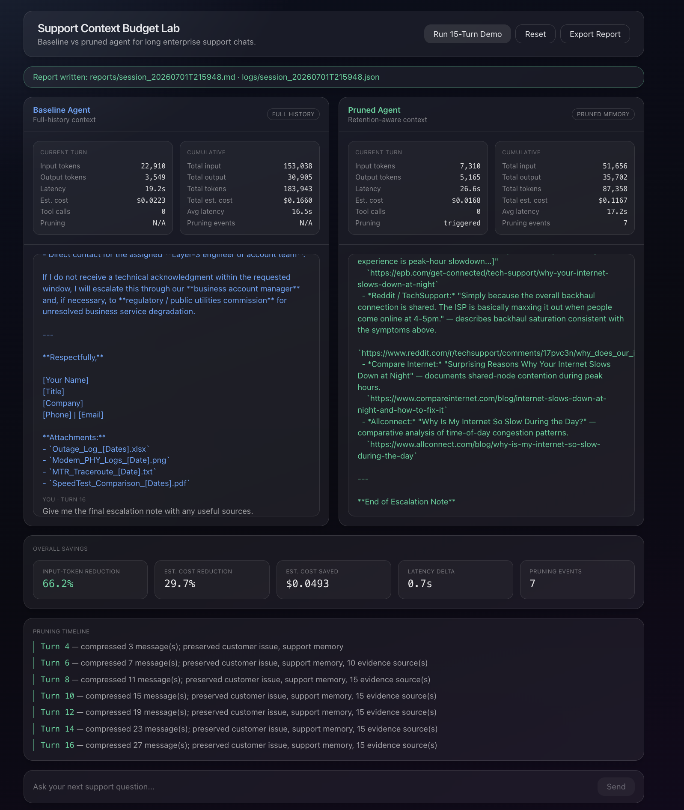
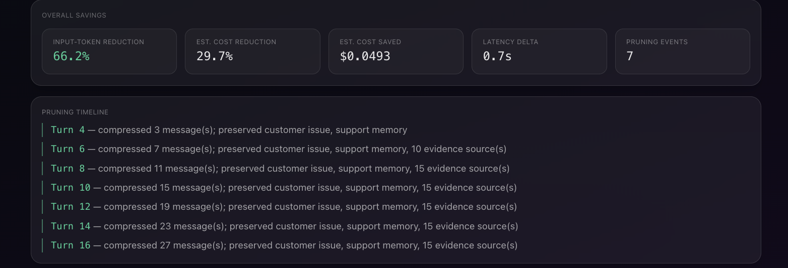
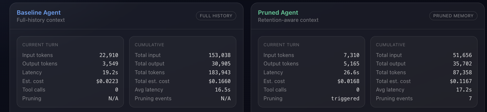

# Support Context Budget Lab — Submission & Outcome Analysis

> **Tavily FDE take-home (Option 1: improve an existing application).**
> This is the entry document for reviewers: what was built, what a real run produced, and how to
> reproduce it. See also [`README.md`](README.md) (setup) and
> [`TECHNICAL_STATEMENT.md`](TECHNICAL_STATEMENT.md) (approach & value).

## What this is

An improvement of the Tavily starter agent into a **UI-first A/B benchmark** for **context pruning**
in enterprise support chats. The same multi-turn conversation is run through two Nebius + Tavily
agents side by side:

- **Baseline agent** — keeps the full conversation history (and all prior Tavily output) every turn.
- **Pruned agent** — a retention-aware pruning engine (support memory + evidence ledger + recent
  turns) that keeps what matters and drops the bloat.

The metrics layer is **independent of pruning** and reads real usage from every Nebius call, so the
comparison is a clean single-variable experiment (only the context strategy differs).



## Outcome of the live run

Source of truth: [`reports/session_20260701T215948.md`](reports/session_20260701T215948.md) ·
full trace: [`logs/session_20260701T215948.json`](logs/session_20260701T215948.json)
(`moonshotai/Kimi-K2.6` on Nebius, Tavily search, prune-every-2 / keep-last-2, **16 turns**).

| Metric | Baseline | Pruned | Result |
|---|---:|---:|---|
| Total **input tokens** | 153,038 | 51,656 | **−66.2%** |
| Total output tokens | 30,905 | 35,702 | +15.5% (pruned wrote more) |
| Total **estimated cost** | $0.1660 | $0.1167 | **−29.7% (−$0.0493)** |
| Avg latency / turn | 16.48s | 17.21s | +0.7s |
| Pruning events | — | 7 | turns 4,6,8,10,12,14,16 |



### Reading the results honestly

**1. Input tokens — the headline win (−66.2%).** The baseline's per-turn input climbs almost
linearly as history accumulates (turn 1: 76 → turn 16: **22,910**), while the pruned agent stays
bounded (turn 1: 176 → turn 16: **7,310**). The gap widens every turn — exactly the enterprise
pain point (long chats get expensive).

**2. The crossover is real and visible.** On **turn 1** the pruned agent uses *more* input (176 vs
76) — its fixed retention scaffolding (persona + retention policy + memory + evidence ledger) costs
tokens up front. It's still slightly higher at turn 2, then **flips at turn 3** (880 vs 1,212) and
never looks back. Pruning is an investment that pays off once the conversation is long enough — which
is the whole customer scenario (~15 turns).

**3. Cost savings (−29.7%) are smaller than input savings (−66.2%) — and here's why.** Cost is
dominated by *output* tokens (priced 4× input), and in this run the pruned agent happened to generate
*more* output (35,702 vs 30,905). Decomposed:

- Input: pruned saved ~**$0.0608**.
- Output: pruned spent ~**$0.0115 more** (more verbose answers).
- **Net: −$0.0493.**

The verbosity is a prompt-design artifact (tunable), not a property of pruning — an honest, useful
finding rather than a number to hide.

**4. Latency did not improve here (+0.7s).** Latency in this run is output-bound (the model spends
most time *generating*, and the pruned agent generated more). Input-token reduction still matters at
scale — context-window headroom, throughput, and time-to-first-token under load — but this
single-user run does not show a latency win, and we don't claim one.



### Pruning timeline

Compression grows every prune turn while the retained state stays compact — the evidence ledger
saturates at 15 deduplicated sources instead of carrying raw Tavily blobs forever:

```
Turn 4  — compressed 3  msgs; preserved customer issue, support memory
Turn 6  — compressed 7  msgs; + 10 evidence sources
Turn 8  — compressed 11 msgs; + 15 evidence sources
Turn 16 — compressed 27 msgs; 15 evidence sources (deduped/capped)
```

### Business projection

Scaling this conversation's savings to the stated customer (**10,000 conversations/month, ~15 turns**):

- **~1.01 billion input tokens saved / month**
- **~$493 / month** in estimated model cost (at this model's pricing)

Small per-chat, but it compounds hard at enterprise support volume.

### Limitations (stated plainly)

- Cost is **estimated** from configurable pricing, not an actual bill.
- Answer **accuracy is not scored** in the MVP (no LLM-judge); we show context retention + pruning
  events instead.
- Numbers are from one real run; LLM output varies between runs.
- Pruning wins on **long** conversations; short chats can favor the baseline (see the turn-1
  crossover above).

---

## How a reviewer can run this

### Prerequisites
- [uv](https://docs.astral.sh/uv/) — `curl -LsSf https://astral.sh/uv/install.sh | sh`
- Node.js 18+ and npm
- A `TAVILY_API_KEY` (app.tavily.com) and `NEBIUS_API_KEY` (tokenfactory.nebius.com)

### One command
```bash
cp .env.example .env      # add your TAVILY_API_KEY and NEBIUS_API_KEY
./run.sh                  # checks prereqs, installs deps, starts backend + frontend
```
- Frontend: http://localhost:3000  ·  Backend: http://127.0.0.1:8000 (`/health`, `/docs`)
- `./run.sh` streams per-call logs to the terminal (each Nebius/Tavily call: tokens, latency, and
  where any hang would be).

### Two ways to reproduce the comparison
1. **Click "Run 15-Turn Demo"** in the UI — it auto-plays the enterprise support scenario, updating
   both agents and all metrics after every turn.
2. **Drive it manually** with the same prompts — the scenario lives in
   [`backend/support_context_budget_lab/scenarios/telecom_support.yaml`](backend/support_context_budget_lab/scenarios/telecom_support.yaml).
   Paste each line into the prompt bar in order to watch the divergence build turn by turn.

Then click **Export Report** to write a fresh Markdown report + JSON log.

### Where to look
- **This run's report:** [`reports/session_20260701T215948.md`](reports/session_20260701T215948.md)
- **This run's full trace (every turn, both agents, all metrics):**
  [`logs/session_20260701T215948.json`](logs/session_20260701T215948.json)
- **All generated logs:** [`logs/`](logs/) · **all reports:** [`reports/`](reports/)
- A committed sample is also included: `reports/sample_report.md`, `logs/sample_session.json`.

### Verify without spending tokens
```bash
cd backend && uv run pytest -q      # 43 tests (pruning, metrics, agents, reporting, logging)
```

---

_Build record (how this was made): [`build-record/`](build-record/) + Traces.com session links._
